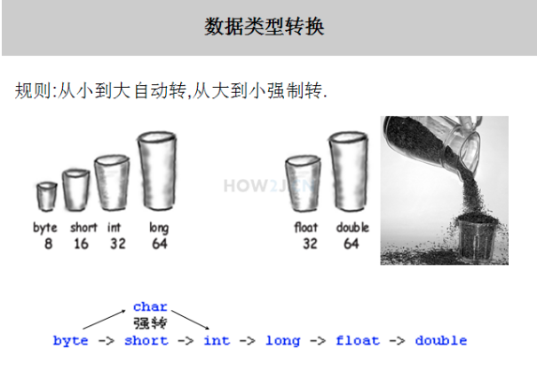

##变量

### 类型转换

转换规则如下：

- 精度高的数据类型如容量大的杯子，可以放更大的数据
- 精度低的数据类型如容量小的杯子，只能放更小的数据
- 小杯子往大杯子里倒东西，大杯子怎么都放得下
- 大杯子往小杯子里倒东西，有的时候放的下，有的时候就会溢出

**隐式类型转换**可以从小到大自动转，即byte->short->int->long如果反过来会丢失精度，必须进行**显示类型转换**

### final

当一个变量被final修饰的时候，该变量**只有一次赋值的机会**。

无论参数是基本数据类型还是引用数据类型，只要加了final，该参数就不可以再赋值(实参进来给形参，相当于初始化完成)可以防止在方法里面不小心重新赋值，以造成不必要的麻烦。

