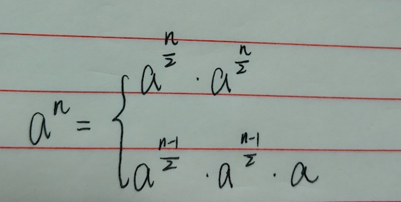

<!--more-->

## 幂指函数

> 难度：    思路：     

### 一、题目描述


### 二、问题分析

幂函数的实现最简单直观的方法是用for循环解决底数相乘n次的问题，但经过观察发现，a的n次幂与a的n/2次幂有关，用递归法可以优雅的解决问题。



### 三、代码分析

```Java
public double mypow(double base,int exepont){
  int absN = Math.abs(exepont);
  if exepont == 0
    return 1;
  if exepont == 1
    return base;
  
  double result = mypow(base, exepont>>2);
  if exepont%1==1
    result *= base;
  result *= result;
  
  return result;  
}
```


**复杂度分析**


