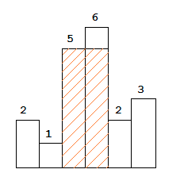

## 这里是大标题

> 难度：hard模式    思路：无     

### 一、题目描述

给定n个非负整数表示直方图的条形高度，其中每个条形的宽度为1，找到直方图中最大矩形的区域。



实例：

```python
Input： [2，1，5，6，2，3]
Output： 10
```

<!--more-->

### 二、问题分析

仔细研究题意，很容易想到矩形的面积是长宽之积，宽为直方图的高度，长为列表中的下标之差。怎样找到最大的矩形呢，唯一的方法是计算每一个条形的面积，两边的条形比它低就可以把其加入到长之中，思路很清晰，但是这样算法的复杂度太高，超出了时间限制。

查看了讨论中的标准JAVA代码，虽然思路是相同的，但是把代码松耦合，大大简化了复杂度。同时**独具匠心的跳转操作将直接简化了算法的运行时间**。

### 三、代码分析

我自己写的代码如下：

```python
def largestRectangleArea(self, heights):
    max_area = 0
    # 一遍for循环但是while循环太耗时了
    for i in range(0,len(heights)):
        target = heights[i]
        front = i-1 
        back = i+1
        # 找到每个条形左边比它高的条形，知道遇到比它矮的条形
        while front >= 0 and target <= heights[front]:
            front -= 1
        # 找到右边比它高的条形
        while  back < len(heights) and target <= heights[back]:              
            back += 1                     
        tmp_area = target * (back-front-1)
        max_area = max(tmp_area,max_area)
    return max_area
```

标准解答如下：

```python
def largestRectangleArea(self, heights):
    if not heights:
        return 0
    max_area = 0
    length = len(heights)
    # 存放每一个条形左边比它小的下标
    left_from = [None] * length
		# 存放右边比它小的左边，为了便于循环控制，下标比实际多1
    right_from = [None] * length
    right_from[length-1] = length
    left_from[0] = -1

    for i in range(1, length):
        p = i-1
        while p>=0 and heights[p] >= heights[i]:
          # 快速跳转，不需要重新扫描左边的每个项目，重用先前计算的结果
            p = left_from[p]
        left_from[i] = p

    for i in range(length-2,-1,-1):
        p = i+1
        while p<length and heights[p] >= heights[i]:
            p = right_from[p]
        right_from[i] = p

    for i in range(0,length):
        max_area = max(max_area, heights[i]*(right_from[i]-left_from[i]-1))

    return max_area
```


**复杂度分析**

时间复杂度：3*O(n)

当直方图的长度大幅升高时，时间复杂度呈线性增加

