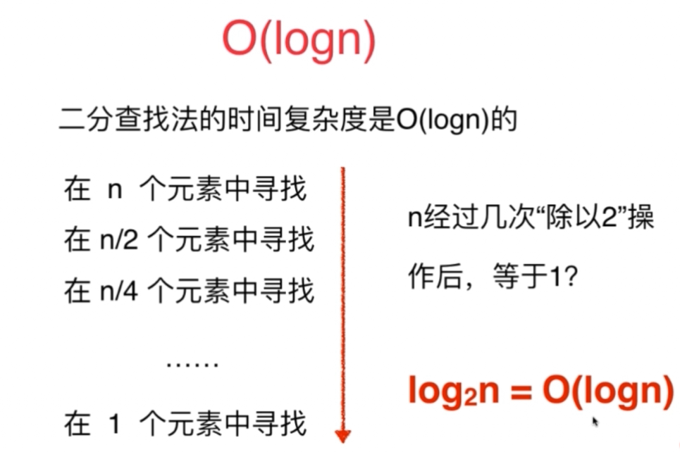

##视频心得

### &算法面试优秀不意味着技术面试优秀

​	项目经历和项目中遇到的实际问题

​	你遇到的印象最深的bug是什么

​	网络相关：安全相关；内存相关；并发相关；…

​	系统设计；scalability；

### &关于过去：参与项目至关重要

不要轻视基础算法和数据结构，而只关注"有意思的题目"

### &解决算法面试问题的基本思路

- 注意题目中的条件
- 当没有思路的时候：自己给自己几个简单的测试用例，测试一下。不要忽视暴力解法。

### &优化算法

- 遍历常见的算法思路
- 遍历常见的数据结构(栈、队列、堆、二叉树)
- 空间和时间的交换(哈希表)

### &实际编写问题

- 计算条件的判断(数组为空，字符串为空，数量为0，指针为空？)
- 变量名
- 模块化，复用性 

### 时间复杂度

O(N)：表示运行算法所需要执行的指令数，和f(N)成正比。

数据规模的概念：

**如果想在1s内解决问题：**

O(n^2)的算法可以处理大约10^4级别的数据；

O(N)的算法可以处理大约10^8级别的数据；

O(N*logN)的算法可以处理大约10^7级别的数据。

**空间复杂度**

多开一个辅助的数组：O(N)

多开一个辅助的二维数组：O(n^2)

多开常数空间：O(1)

 ***递归调用是有空间代价的***：递归调用的深度是多少，整个递归调用的空间复杂度就是多少。

在谈论算法的速度时，随着输入的增加，其运行时间将以什么样的速度增加。

