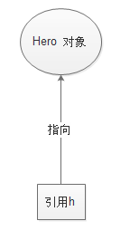

## 方法

### 信息隐藏

换而言之是抽象，隐藏了像用户获取数据、对数据作信号检查、再返回信息给你等繁琐过程。

一个变量只存在于定义它或者它这类变量的方法之内。

编写整个类（多重类别）：

当你调用类别的时候，分别有类别的客户 client即类别的使用者，类别的实现者implementor。

### 对象与对象变量

要想使用对象，就必须先构造对象，并指定其初始状态。

```java
Date birthday = new Date();
Hero h = new Hero();
```

通常，希望构造的对象可以多次使用，因此，需要将对象存放在一个变量中。

**一个对象变量并没有包含一个对象，而仅仅引用一个对象**



**一个类包含以下类型变量**：

- 局部变量：在方法、构造方法或者语句块中定义的变量被称为局部变量。变量声明和初始化都是在方法中，方法结束后，变量就会自动销毁。当方法结束，变量也随之结束。
- 成员变量（也称实例变量）：成员变量是定义在类中，方法体之外的变量。这种变量在创建对象的时候实例化。成员变量恶意别类中方法、构造方法和特定类的语句块访问。在类别中声明的。对于对象中所有的方法都是可见的。不同的对象获得不同的实例变量。实例变量属于对象所私有、独有的变量。
- 类变量：也叫静态变量，类变量也声明在类中，方法体之外，但必须声明为**static**类型。它属于整个类所有，而不是某个对象所有，即被**类的所有对象所共享**。

### final

`final`关键字可以修饰类、方法、属性和吧变量。

1、final修饰类，则该类不允许被继承，为最终类。

2、final修饰方法，则该方法不允许被覆盖（重写）

3、final修饰属性：则该类的属性不会进行隐式的初始化（类的初始化属性必须有值）或者在构造方法中赋值（但只能选其一）
4、final修饰变量，则该变量的值只能赋一次值，即常量。

### 继承

- 子类拥有父类除private以外所有的属性和方法
- 子类可以拥有自己的属性和方法
- 子类可以重写实现父类的方法，一个类只有一个父类。

>注：Java实现多继承的一个方法是implements（实现）接口

### 向上转型

由于Dog继承与Animal，所有Dog可以自动向上转型为Animal，所以b是可以指向Dog实例对象的。

>**注：不能使用一个子类的引用去指向父类的对象。**

如果定义了一个指向子类对象的父类的引用类型，那么它除了能够引用父类中所定义的所有属性和方法外，还可以使用子类强大的功能。但是对于只存在于子类的方法和属性就不能获取。

**因此，向上转型时，在运行时，会遗忘子类对象中与父类对象中不同的方法，也会覆盖与父类中相同的方法——重写。（方法名，参数都相同）**

Java实现多态有三个必要条件：继承、重写和向上转型（即父类引用指向子类对象）。

只有满足上述三个条件，才能给在同一个继承机构中使用统一的逻辑实现代码处理不同的对象，从而达到执行不同的行为。

Java中多态的实现方式：继承父类进行方法重写，抽象类和抽象方法，接口实现。

### 可见性

类中的**大部分内容**都是**private**，除非可以设定为public。

类中大部分内容都保持隐私。

对象也可以作为参数传进去。

属性没有修饰符时即代表package/friendly/default 默认包可见

当传递一个对象时，传递的不是对象的副本，而是对象本身，类似于指针的概念吧。

**作用范围最小原则**：

​	能用private就用private，不行就放大一级，用package，再不行就用protected，最后用public。这样就能把数据尽量的封装起来 ，没有必要露出来的，就不用露出来了。