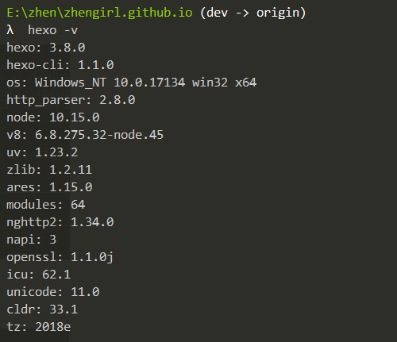
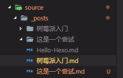
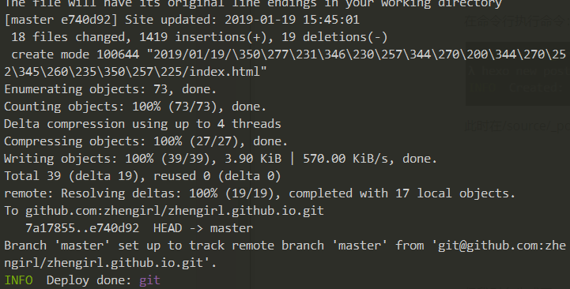

##    Hexo+GitHub搭建个人博客

*author：刘真真* 

> **写在前面：**去年三月份时候阿里云做活动就申请了一个域名，但是一直觉得搭建网站是一个比较麻烦的时候，就搁置了很久，在男朋友的鼓励下，遂决定好好捯饬一下自己的网站拿来写博客，开始一直担心自己做不出比较好的效果，后面渐渐将这种想法搁置，网上有非常多hexo的爱好者将自己的过程分享出来，基本上踩得坑都是前人遇到的，前人栽树后人乘凉，我也将搭建博客中一些关键性的步骤总结一下，以防后人跳坑。本人没有接触过前端知识，全凭谷歌和百度，所以有搭建个人网站想法的同学尽管去做，开始了第一步，后面的就不是问题了。

### 一、前期准备

#### 1.1、安装Node.js

在[Node.js官网](https://nodejs.org/en/)下载对应平台的安装程序。在Windows上安装时需选择全部组建，勾选`Add to Path`,打开命令行安装成功可以看到


#### 1.2、安装git

在[Git官网](https://git-scm.com/downloads)上下载Windows的安装程序。安装完成后，在开始菜单里找到"Git bsah Here",弹出一个类似命令行的窗口，说明Git安装成功！


同时配置电脑的环境变量，或者在安装的时候选择`use Git from the Windows Command Prompt`,即可在命令行中调用git。

#### 1.3、Github账户注册和新建项目

项目必须要遵守格式：`账户名.github.io`，以免后面产生不必要的麻烦。

#### 1.4、安装hexo

在电脑的任何位置建一个文件夹，我在E盘建了一个与工程同名的`zhengirl.github.io`文件夹，然后通过命令行进入该文件夹：


输入`npm install hexo -g`,开始安装hexo，输入`hexo -v`,检查hexo是否安装成功。



输入`hexo init`,初始化文件夹。经过漫长的等待，可以看到`Start blogging with Hexo！`。

输入`npm install `，安装所需要的组件。

### 二、本地网页的搭建

####  2.1、体验hexo

在安装好前面需要的一系列包后，输入`hexo g`，首次体验Hexo。

输入`hexo s`，开启服务器，访问该网址，正式体验Hexo。


#### 2.2、将Hexo与github page联系起来

首先需要设置Git的user name和email（如果是第一次使用的话）。打开命令行

```git
$ git config --golbal user.name. "author" #将用户名设为author
$ git config --global user.email "author@corpmail.com" #将用户邮箱设为author@corpmail.com
```

添加SSH，详情见这篇[博客](https://www.cnblogs.com/chuyanfenfei/p/8035067.html),输入`ssh -T gi@github.com`,测试添加ssh是否成功。如果看到Hi后面是你的用户名，就说明成功了。


#### 2.3、配置Deployment

用VScode打开`zhengirl.git.com.io`,即整个工程，找到站点配置文件`_config.yml`，查找repo并修改，在文件末尾：

```yaml
deploy:
  type: git
  repository: git@github.com:zhengirl/zhengirl.github.io.git
  branch: master
```

#### 2.4、新建博客

在命令行执行命令：`hexo new post “博客名”`


此时在/source/_posts下可以看到已经创建的文件



但这里则多生成了一个博客名的文件夹，至于为什么会生成这个文件夹以及它的用途，我们在下篇文章详解。

#### 2.5、部署文章

在生成以及部署文章之前需要安装一个扩展，`npm install hexo-develoyer-git --save`，编辑好文章后输入`hexo d -g`，生成和部署网站。



部署成功后访问网址：`http://用户名.github.io`,将看到部署成功的整个网站。

至此为止，最基本的hexo+github搭建个人博客基本完成，但是我们的博客还是太简陋了一些，接下来需要对博客进行一些雕琢。