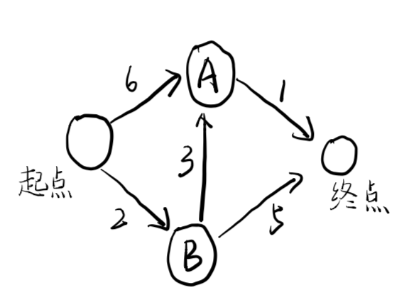
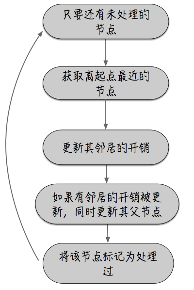

## 狄克斯特拉算法

理念：找出图中最便宜的节点，并确保没有到该节点的更便宜的路径。

 ### 一、思想

四个步骤如下：

- 找出开销最少的节点（最便宜），即可在最短时间内前往的节点
- 对于该节点的邻居，检查是否有前往他们的更短路径，如果有，则更新其开销
- 重复这个过程，直到对图中的每个节点都这样做了。
- 计算最终路径。

### 二、适用情况

- 在无向图中，每条边都是一个环，狄克斯特拉算法只试用于有向无环图。（DAG）
- 不能将狄克斯特拉算法用于包含负权边的图。

### 三、算法步骤

**需解决的问题:**找出从起点到终点最短的路径

需三个散列表

**GRAPH 图**

| 起点 | A      | 6     |
| ---- | ------ | ----- |
| 起点 | B      | 2     |
| A    | 终点   | 1     |
| B    | A      | 3     |
| B    | 终点   | 5     |
| 终点 | ------ | ----- |

**costs表（开销）**：是指从起点出发前往该节点所需要的时间

| A    | 6    |
| ---- | ---- |
| B    | 2    |
| 终点 | INF  |

**parents散列表**：存储每一个节点的父节点

| A    | 起点  |
| ---- | ----- |
| B    | 起点  |
| 终点 | ----- |

随着算法的进行，将不断更新散列表costs和parents散列表。

**算法流程图：**

**算法实现：**

~~~python
graph = {} #存储所有的节点的图

graph['start'] = {}
graph['start']['a'] = 6
graph['start']['b'] = 2

graph['a'] = {}
graph['a']['fin'] = 1

graph['b'] = {}
graph['b']['a'] = 3
graph['b']['fin'] = 5

graph['fin'] = {}#终点没有任何邻居

processed = [] #用一个数组记录处理过的节点，对于同一个节点，不需要处理多次

# 实现狄克斯特拉算法
node = find_lowest_cost_node(costs) #在未处理的节点中找出开销最小的节点
while node is not None: #此while循环在所有节点都被处理后结束
    cost = cost[node]
    neighbors = graph[node]
    for n in neighbors.keys():#遍历当前节点的所有邻居
        new_cost = cost + neighbors[n]
        if costs[n] > new_cost:
            costs[n] = new_cost
            parents[n] = node
    processed.append(node) #将当前节点标记为已处理
    node = find_lowest_cost_node(costs) #找出接下来要处理的节点，并循环
~~~

